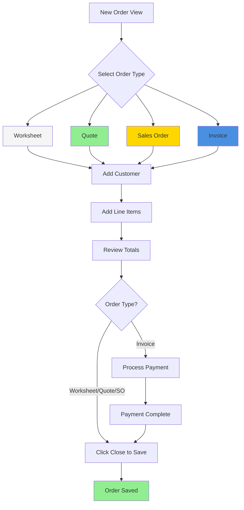

import { Callout } from "@/components/Callout"
import { CardGrid } from "@/components/CardGrid"
import { Card } from "@/components/Card"
import { Steps } from "@/components/Steps"

# Order View Overview

The **Order View** is the primary interface for creating and editing all types of orders in Weevio Store. Whether you're creating a quick worksheet, generating a quote, processing an invoice, or managing a sales order, this unified interface provides all the tools you need.

<Callout type="info">
The Order View dynamically adapts based on the order type you select, showing relevant features and hiding unavailable options. For example, payment options only appear for invoices.
</Callout>

## What is the Order View?

The Order View is a comprehensive order management interface that allows you to:

- Create new orders from scratch or edit existing orders
- Switch between order types (Worksheet, Quote, Sales Order, Invoice)
- Manage customer information (billing and shipping)
- Add and configure line items with pricing, discounts, and serial numbers
- Process payments and finalize invoices
- Configure shipping and dropship options
- Track order totals including tax, shipping, and discounts

## Interface Layout

The Order View is organized into distinct sections to streamline your workflow:

### 1. Order Header

Located at the top of the interface, the order header displays:

- **Order Number**: Auto-generated unique identifier (click to copy)
- **Order Type**: Visual indicator showing current order type with color coding:
  - **Worksheet** (white): Draft orders for internal use
  - **Quote** (green): Customer price quotes
  - **Sales Order** (yellow): Confirmed orders awaiting fulfillment
  - **Invoice** (blue): Finalized orders with payment
  - **Void** (red): Cancelled orders
- **Salesperson Code**: Employee responsible for the order
- **PO Number**: Customer's purchase order reference
- **Reference Number**: Internal reference tracking

### 2. Customer Information Tabs

Switch between two customer information panels:

- **Customer Billing**: Billing name, address, contact information
- **Customer Shipping**: Shipping destination, contact details
- **Quick Actions**: Search customers, view customer records, access shipping locations

<Callout type="tip">
Use the "Shipping Locations" button to quickly populate shipping information from saved customer addresses.
</Callout>

### 3. Line Items Table

The central workspace for adding products and services:

- Product search and autocomplete
- Quantity, pricing, and discount management
- Serial number assignment for serialized inventory
- AppleCare and warranty product association
- Stock availability indicators
- Line-level tax exemption controls

### 4. Footer Section

Bottom area with order controls:

- **Left Side**: Miscellaneous options (dropship settings, stock adjustments)
- **Right Side**: Order totals and action buttons
  - Subtotal, tax, shipping, and grand total
  - Save/Close button
  - Print and email options

## Understanding Order Types

Orders in Weevio Store progress through different types based on their lifecycle:

### Worksheet
- **Purpose**: Internal draft orders, planning, and temporary order storage
- **Characteristics**: No payment required, fully editable, not synced to accounting
- **Use Case**: Building an order before converting to quote or sales order

### Quote
- **Purpose**: Formal price quotes for customers
- **Characteristics**: Editable, can be printed/emailed to customers
- **Use Case**: Providing pricing to prospective customers
- **Conversion**: Can be converted to Sales Order or Invoice

### Sales Order
- **Purpose**: Confirmed orders awaiting fulfillment or payment
- **Characteristics**: Editable, tracks inventory commitments
- **Use Case**: Orders approved but not yet paid
- **Conversion**: Can be converted to Invoice when ready for payment

### Invoice
- **Purpose**: Finalized orders with payment processed
- **Characteristics**: Limited editing after payment, creates accounting records
- **Use Case**: Completed sales transactions
- **Note**: Once paid, invoices become locked and cannot be converted to other types

<Callout type="warning">
**Important**: Converting between order types has restrictions. For example, you cannot convert a paid Invoice back to a Worksheet. The system will warn you if a conversion is not allowed.
</Callout>

## Core Workflows

### Creating a New Order

<Steps>
1. **Navigate to Order View**: Click "New Order" from the POS menu or order list
2. **Set Order Type**: Select the appropriate order type from the dropdown (defaults to your configured preference, typically Worksheet)
3. **Add Customer** (Optional but recommended):
   - Search by name, email, or customer code in the "Name / Search" field
   - Select from search results
   - Or continue without linking a customer
4. **Add Line Items**:
   - Click in the first empty Part Number field
   - Search for products using part number, description, or barcode
   - Set quantity and verify pricing
   - Repeat for additional items
5. **Review Totals**: Check subtotal, tax, and grand total in the footer
6. **Finalize**:
   - For Worksheets/Quotes/Sales Orders: Click "Close" to save
   - For Invoices: Process payment when prompted, then close
</Steps>

### Editing an Existing Order

<Steps>
1. **Open the Order**: Navigate from order list, search results, or customer record
2. **Verify Order Type**: Check the order type indicator in the header
3. **Make Changes**: Edit customer info, add/remove line items, adjust quantities
4. **Auto-Save**: Changes save automatically as you move between fields
5. **Close**: Click "Close" when finished
</Steps>

<Callout type="info">
Paid invoices have limited editing capabilities. You cannot modify line items or customer information once payment is processed.
</Callout>

### Converting Order Types

To convert an order from one type to another:

1. Open the order you want to convert
2. Click the **Order Type** dropdown in the header
3. Select the new order type
4. Confirm the conversion when prompted
5. The system will validate the conversion and update the order

**Common conversions:**
- Worksheet → Quote → Sales Order → Invoice (typical sales flow)
- Quote → Invoice (direct sale from quote)
- Sales Order → Worksheet (downgrade if order is cancelled)

## Navigation and Controls

### Keyboard Shortcuts

- **Tab**: Move to next field
- **Shift + Tab**: Move to previous field
- **Enter**: Submit current field and move to next
- **Esc**: Cancel current modal or popup

### Saving Behavior

The Order View uses **auto-save** for most changes:

- **Header fields** (PO Number, Reference Number): Save when you leave the field (onBlur)
- **Line items**: Save when you complete a row or move to another field
- **Customer information**: Saves automatically when field loses focus
- **Order type changes**: Save immediately upon conversion

<Callout type="success">
Look for brief "Saving..." indicators in the order type badge when auto-save occurs.
</Callout>

### Closing and Canceling

- **Close Button**: Saves all pending changes and returns to order list
- **Browser Back**: Not recommended (use Close button instead)
- **Unsaved Changes**: Auto-saved in real-time, no prompt needed

## Feature Areas Quick Reference

The Order View includes several specialized features, each documented in detail on their own pages:

<CardGrid>
  <Card
    title="Customer Management"
    href="/docs/store/orders/customer-management"
    description="Search, link, and manage customer information within orders"
  />
  <Card
    title="Line Items"
    href="/docs/store/orders/line-items"
    description="Add products, set quantities, manage pricing and inventory"
  />
  <Card
    title="Pricing & Discounts"
    href="/docs/store/orders/pricing-discounts"
    description="Apply customer pricing, price codes, and custom discounts"
  />
  <Card
    title="Serial Numbers"
    href="/docs/store/orders/serial-numbers"
    description="Assign and track serial numbers for serialized inventory"
  />
  <Card
    title="Payments"
    href="/docs/store/orders/payments"
    description="Process payments for invoices using various payment methods"
  />
  <Card
    title="Shipping & Dropship"
    href="/docs/store/orders/shipping-dropship"
    description="Configure shipping addresses and dropship options"
  />
</CardGrid>

## Quick Start: Your First Order

Ready to create your first order? Here's a simple example:

<Steps>
1. **Click "New Order"** from the Store menu
2. **Search for a customer**: Type a name in "Name / Search" and select from results
3. **Add a product**:
   - Click the first Part Number field
   - Type a product name or code
   - Select from autocomplete results
   - Verify quantity (default is 1)
4. **Review the total**: Check the Grand Total in the bottom right
5. **Set order type**:
   - Keep as "Worksheet" for a draft
   - Or change to "Invoice" to process payment
6. **Finalize**:
   - If Invoice: Complete payment when prompted
   - Click "Close" to save
</Steps>

<Callout type="success">
Congratulations! You've created your first order. The order is now saved and can be found in your order list.
</Callout>

## Order Workflow Diagram

## Best Practices

### Order Type Selection
- Start with **Worksheets** when building complex orders or quotes
- Use **Quotes** for formal customer price requests
- Convert to **Sales Order** when customer confirms but hasn't paid
- Only use **Invoice** when ready to process payment

### Customer Linking
- Always link a customer for quotes and invoices
- Customer linking enables:
  - Customer-specific pricing
  - Shipping location quick-fill
  - Order history tracking
  - Automatic tax calculations

### Line Item Entry
- Use autocomplete to find products quickly
- Verify stock availability before finalizing
- Assign serial numbers for serialized items before closing invoices
- Review pricing carefully when applying discounts

### Payment Processing
- Verify the grand total before processing payment
- Ensure all serial numbers are assigned (for invoices)
- Check that customer information is complete
- Print or email receipt immediately after payment

## Common Scenarios

### Scenario: Walk-in Sale
1. Open new order
2. Set to "Invoice" immediately
3. Add line items (no customer needed for cash sales)
4. Process payment
5. Print receipt

### Scenario: Phone Quote
1. Open new order as "Quote"
2. Search and link customer
3. Add requested items
4. Review totals with customer
5. Email quote PDF
6. Convert to Sales Order when customer approves

### Scenario: Special Order
1. Create as "Sales Order"
2. Link customer
3. Add special order items (may show backorder status)
4. Configure dropship if vendor ships directly
5. Convert to Invoice when items arrive and customer is ready to pay

## Troubleshooting

### Order Won't Save
- **Check validation**: Ensure salesperson code is valid
- **Line items**: Verify all line items have valid part numbers
- **Network**: Confirm you're connected to the internet

### Can't Convert Order Type
- **Paid invoices**: Cannot be converted to other types
- **Invalid conversions**: Some conversions are restricted (system will explain)
- **Required fields**: Ensure customer is linked for certain conversions

### Changes Not Appearing
- **Auto-save**: Click outside the field to trigger save
- **Refresh**: Close and reopen the order to see latest changes
- **Permissions**: Verify you have edit access to the order

## Next Steps

Now that you understand the Order View interface, dive deeper into specific features:

- **[Customer Management](/docs/store/orders/customer-management)**: Learn advanced customer search and linking
- **[Line Items](/docs/store/orders/line-items)**: Master product entry and inventory management
- **[Pricing & Discounts](/docs/store/orders/pricing-discounts)**: Understand pricing rules and discount application
- **[Payments](/docs/store/orders/payments)**: Process payments with various methods
- **[Serial Numbers](/docs/store/orders/serial-numbers)**: Track and assign serial numbers
- **[Shipping & Dropship](/docs/store/orders/shipping-dropship)**: Configure shipping and dropship orders

<Callout type="info">
Have questions? Contact your system administrator or refer to the complete Weevio Store documentation.
</Callout>
